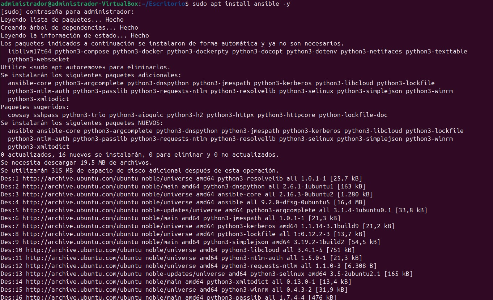
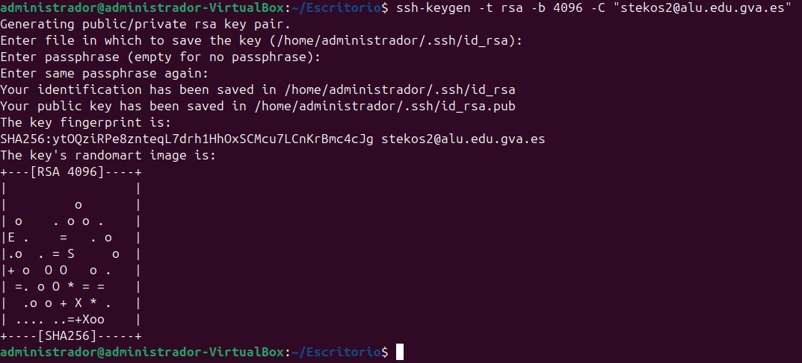
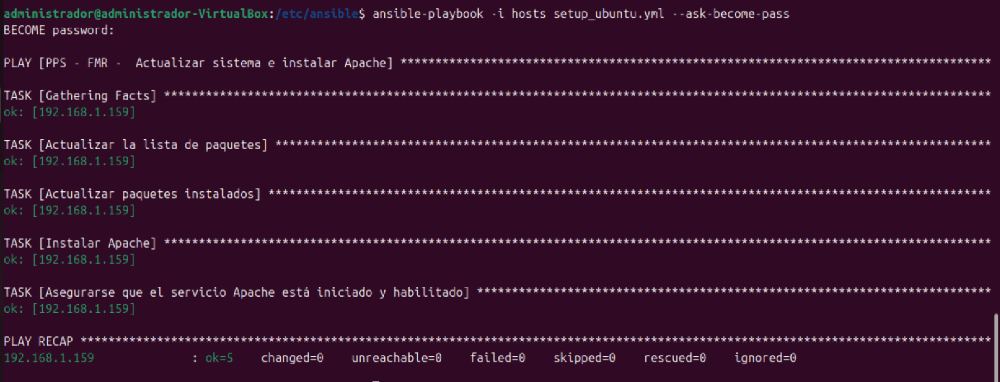
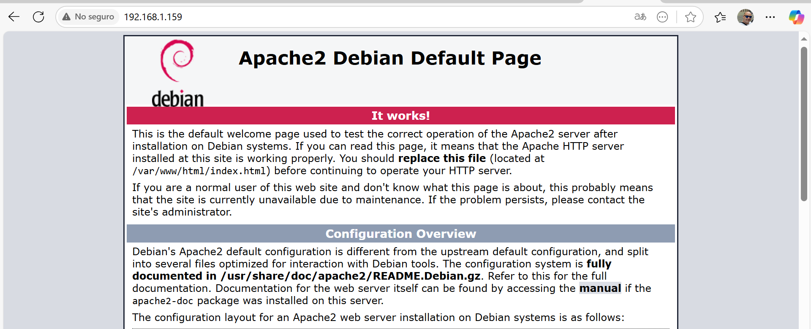

# 2. Configuración de una máquina virtual Ubuntu 24.04 en VirtualBox usando Ansible
En esta sección se describe cómo automatizar la configuración de una máquina virtual con Ubuntu 24.04 utilizando Ansible. Las tareas a realizar incluyen la actualización del sistema y la instalación del servidor web Apache.

Para llevar a cabo esta configuración, se ha instalado Ansible en una máquina virtual con Ubuntu Desktop 24.04.1.

## Instalación y preparación de Ansible

Una vez completada la instalación y verificado el funcionamiento de Ansible, es necesario establecer la comunicación por SSH, ya que Ansible se conecta con los equipos remotos a través de este protocolo.



Generamos una clave SSH con el siguiente comando:

``` bash
ssh-keygen -t rsa -b 4096 -C "stekos2@alu.edu.gva.es"
```



Después, copiamos la clave pública al equipo remoto que será gestionado por Ansible:

``` bash
ssh-copy-id administrador@192.168.1.159
```

## Configuración de Ansible

Creamos el directorio de configuración, si no existe:

``` bash
sudo mkdir -p /etc/ansible
```

A continuación, editamos el archivo /etc/ansible/hosts, donde especificamos los equipos a gestionar. En este caso, se añade una entrada para un servidor remoto:


``` yaml
- name: PPS - FMR - Actualizar sistema e instalar Apache
  hosts: all
  become: yes

  tasks:
    - name: Actualizar la caché de paquetes
      apt:
        update_cache: yes

    - name: Aplicar actualizaciones del sistema
      apt:
        upgrade: dist
        autoremove: yes
        autoclean: yes

    - name: Instalar Apache
      apt:
        name: apache2
        state: present

    - name: Asegurar que Apache está activo y habilitado
      service:
        name: apache2
        state: started
        enabled: yes
```

# Ejecución del playbook

Con todo listo, ejecutamos el playbook mediante el siguiente comando:

``` bash
ansible-playbook -i hosts setup_ubuntu.yml --ask-become-pass
```



Tras completar el proceso, si accedemos a la dirección IP de la máquina configurada desde un navegador, deberíamos ver la página de inicio predeterminada de Apache, lo que indica que la instalación y configuración fueron exitosas.


