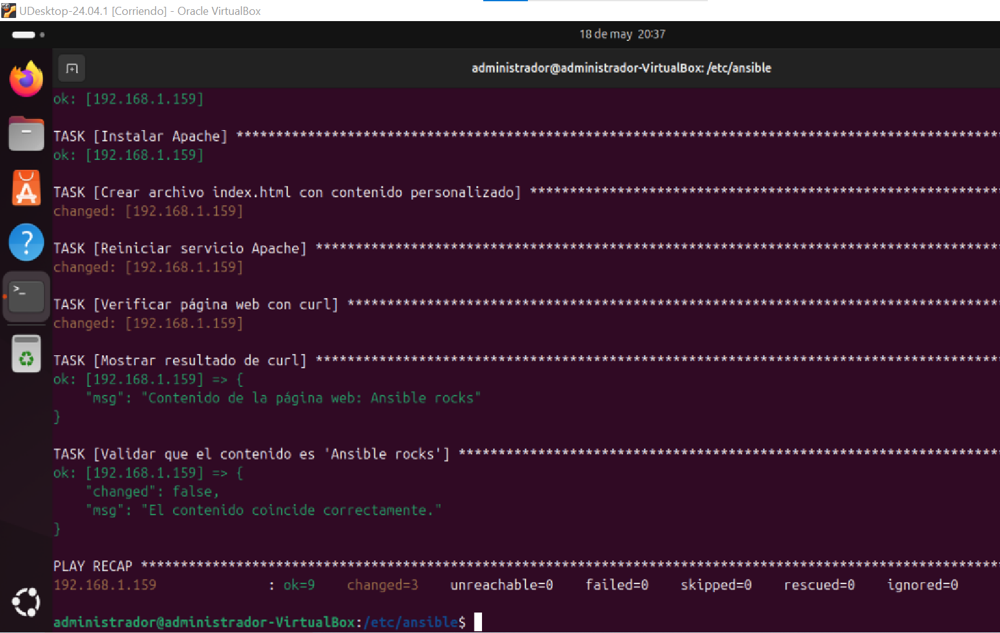
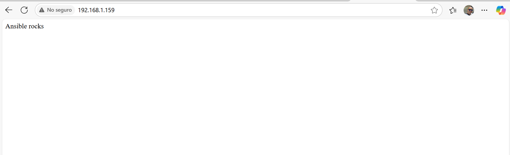

# 3. Personalización de una máquina virtual Ubuntu 24.04 con Ansible: creación de una página web

Esta sección representa una extensión práctica del apartado anterior (3.2), añadiendo un paso adicional: la personalización de la página principal del servidor web.

El objetivo es crear un archivo index.html con el texto "Ansible rocks", colocarlo en el directorio de publicación de Apache, reiniciar el servicio y verificar su correcto funcionamiento mediante una petición curl.

## Playbook para la creación del index.html

Para ello, se ha preparado un nuevo playbook denominado setup_3_3.yml, que incluye tanto la instalación y configuración de Apache como la creación del contenido personalizado y la comprobación final.

``` yaml
---
- name: Configurar Ubuntu 24.04 con Apache y contenido web personalizado
  hosts: all
  become: yes

  tasks:
    - name: Actualizar la caché de paquetes
      apt:
        update_cache: yes

    - name: Aplicar actualizaciones del sistema
      apt:
        upgrade: dist
        autoremove: yes
        autoclean: yes

    - name: Asegurar la instalación de Apache
      apt:
        name: apache2
        state: present

    - name: Crear archivo index.html con mensaje personalizado
      copy:
        dest: /var/www/html/index.html
        content: "Ansible rocks\n"
        owner: www-data
        group: www-data
        mode: '0644'

    - name: Reiniciar el servicio Apache para aplicar cambios
      service:
        name: apache2
        state: restarted

    - name: Realizar petición HTTP con curl
      command: curl -s http://localhost
      register: curl_result

    - name: Mostrar resultado de la petición curl
      debug:
        msg: "Contenido recibido: {{ curl_result.stdout }}"

    - name: Verificar que el contenido es el esperado
      assert:
        that:
          - "'Ansible rocks' in curl_result.stdout"
        fail_msg: "El contenido devuelto no es el esperado."
        success_msg: "Contenido verificado correctamente."
```

## Ejecución y verificación



Una vez ejecutado el playbook, se puede acceder a la dirección IP del servidor desde un navegador web y comprobar que el archivo index.html ha sido creado correctamente y contiene el texto especificado.

Además, el propio playbook incluye una verificación automática con curl y muestra el resultado en la consola, asegurando así que la configuración ha sido aplicada con éxito.



Este ejemplo demuestra cómo Ansible puede ir más allá de la simple instalación de paquetes, permitiendo realizar tareas de configuración más específicas de forma automatizada y escalable. Con un solo comando, es posible aplicar esta configuración personalizada a múltiples servidores, lo que muestra claramente la potencia de esta herramienta en contextos reales de administración de sistemas.
